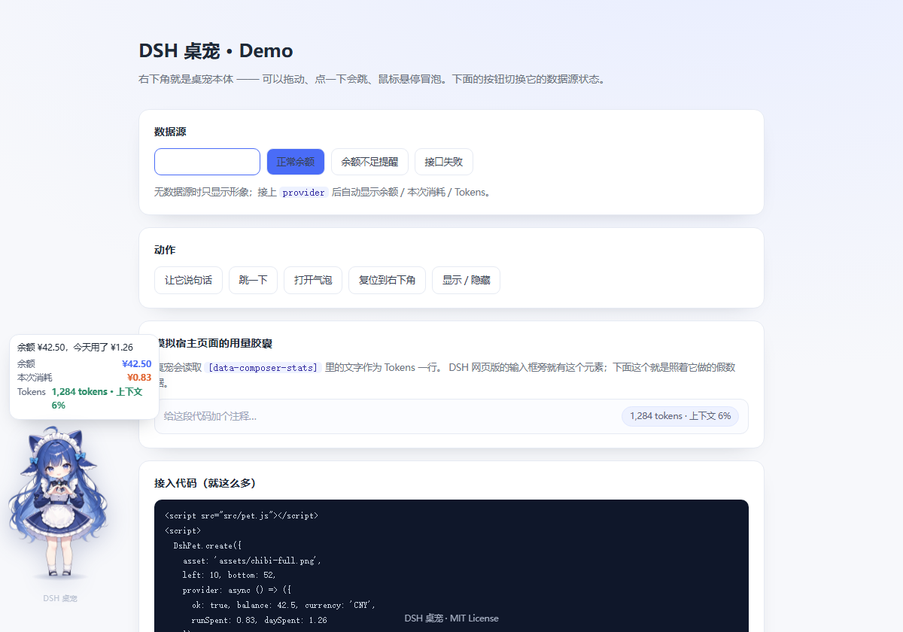

# DSH 桌宠 · dsh-desktop-pet

一只住进网页角落的 Q 版桌宠：**会漂浮、会呼吸、能拖动、点一下会跳**，顺手把 **DeepSeek 余额 / 本次消耗 / Tokens** 显示在它头顶的气泡里。



**在线试玩** → https://terrycool11.github.io/dsh-desktop-pet/demo/

> 想在本机看效果：用浏览器打开 `demo/index.html` 就行（纯前端，无需服务器、无需 API Key）。

---

## 它是什么

- **一个 17 KB 的纯 JS 库**（`src/pet.js`），零依赖，UMD，注入任意页面即可出现桌宠
- **形象可换**：默认给了一张示例立绘；`tools/make-asset.ps1` 能把任意浅色背景立绘变成透明底素材
- **可以配真人语音**：拖动 / 点击 / 告别时播你自己录的音频（`clips` 选项，库本身不带音频）
- **数据源可插拔**：接上 `provider` 就显示余额/消耗/Tokens，不接就是纯装饰
- **三种用法**：网页直接引 / 油猴脚本 / Electron 应用（下面都有）

---

## 快速开始

### 方式一：网页里引一行

```html
<script src="src/pet.js"></script>
<script>
  DshPet.create({
    asset: 'assets/chibi-full.png',   // 形象图片
    left: 10, bottom: 52,             // 初始位置
    provider: async () => ({          // 数据源，不接就传 null
      ok: true, balance: 42.50, currency: 'CNY',
      runSpent: 0.83, daySpent: 1.26
    })
  });
</script>
```

就这样，桌宠出现在左下角。拖动它会记住位置（`localStorage`）。

### 方式二：油猴脚本（不改宿主页面）

装 [Tampermonkey](https://www.tampermonkey.net/) → 新建脚本 → 粘贴 [`adapters/userscript.js`](adapters/userscript.js) → 保存。

- 默认只在 `127.0.0.1` / `localhost` 上生效（因为主要是配合本地 DSH 网页版用）；想让它在所有网站出现，把 `@match` 改成 `*://*/*`
- 脚本菜单里可以填 DeepSeek API Key（**只存在本机油猴存储里**）、显示/隐藏、复位位置、立刻刷新余额
- 余额靠 `GM_xmlhttpRequest` 直连 `api.deepseek.com`，绕开浏览器跨域限制

### 方式三：Electron 应用

```
your-app/
├─ main.js               ← 见下面的接线
├─ preload.js            ← 用 adapters/preload.js
└─ vendor/dsh-desktop-pet/   ← 把本仓库放进来
```

主进程：

```js
const { app, BrowserWindow, ipcMain } = require('electron');
const path = require('path');
const pet = require('./vendor/dsh-desktop-pet/adapters/electron.js');

const tracker = pet.createUsageTracker({
  apiKey: process.env.DEEPSEEK_API_KEY,          // 你的密钥
  storePath: path.join(app.getPath('userData'), 'pet-usage.json')
});

app.whenReady().then(() => {
  tracker.start();
  pet.installIpc(ipcMain, { tracker, asset: path.join(__dirname, 'vendor/dsh-desktop-pet/assets/chibi-full.png') });

  const win = new BrowserWindow({
    webPreferences: { preload: path.join(__dirname, 'preload.js'), contextIsolation: true }
  });
  win.loadURL('http://127.0.0.1:3080/');
  pet.attachPet(win.webContents, { width: 140 });   // 自动注入 + 页面刷新后自动补回
});
```

`attachPet()` 会在页面加载完成后注入桌宠，并每 4 秒检查一次（页面换视图被清掉时补回来）；返回值是取消函数。

---

## 配置项

`DshPet.create(options)`

| 选项 | 默认 | 说明 |
| --- | --- | --- |
| `asset` | `''` | 形象图片地址（URL 或 data URL） |
| `width` | `140` | 显示宽度（像素） |
| `ratio` | `431/300` | 素材高宽比，默认对应示例立绘 300×431 |
| `left` / `bottom` | `10` / `52` | 初始位置 |
| `mount` | `document.body` | 挂载容器 |
| `storageKey` | `dsh-pet-pos` | 位置记忆的 key |
| `draggable` | `true` | 是否可拖动 |
| `tip` | `拖动我可以换位置` | 悬停时底下的小字，传 `''` 关掉 |
| `brand` | `''` | 桌宠下方的小署名 |
| `bubbleWidth` | `200` | 气泡宽度 |
| `autoBubbleMs` | `7000` | 出现后自动冒泡时长（0 = 不自动冒泡） |
| `refreshMs` | `30000` | 定时刷新数据源的间隔 |
| `provider` | `null` | `async () => ({ ok, balance, currency, runSpent, daySpent })` |
| `tokensSelector` | `[data-composer-stats]` | 从页面哪个元素读 Tokens 文字 |
| `labels` | `{balance,run,tokens}` | 气泡三行的标题 |
| `colors` | `{...}` | 三行数值的颜色 |
| `lowBalance` | `5` | 低于这个余额就提醒充值 |
| `dragText` | `主人要把我带去哪？` | 拖动时气泡里显示的话（松手恢复原内容） |
| `clickTexts` | 8 句 | 点击时轮着说的话，改这里就换成你自己的 |
| `clickResetMs` | `10000` | 点完多久没再点，就恢复原本的余额内容 |
| `farewellText` | `主人，下次再见吧！` | 退出前告别的话（宿主主动调 `farewell()`） |
| `clips` | `null` | 真人语音素材：`{ drag: url, click: [url…], farewell: url }`，见下节 |
| `voice` / `voiceVolume` | `true` / `1` | 是否播放、音量 |
| `onReady` | `null` | 拿到桌宠实例的回调 |

返回的对象：

```js
const pet = DshPet.create({...});
pet.el           // 根元素（想改样式/隐藏就操作它）
pet.refresh()    // 立刻重新取数据并刷新气泡
pet.say('文字')   // 说句话（第二个参数 ms 之后恢复原本的余额内容）
pet.setLine('文字')  // 只显示不进数据、不自动消失（宿主想自己控制时用）
pet.farewell()   // 告别：显示 farewellText + 播告别语音；返回说了哪句
pet.play('click', 0)  // 手动播一条语音
pet.setClips(c)  // 之后挂上/换掉语音素材
pet.mute(true)   // 静音（气泡照常显示）
pet.clearSay()   // 立刻恢复原本的余额内容
pet.show(ms)     // 打开气泡（ms 后自动关；不传则长开）
pet.hide()       // 关掉气泡
pet.hop()        // 跳一下
pet.destroy()    // 移除桌宠并解绑事件
```

**交互**：

| 操作 | 反应 |
| --- | --- |
| 按住拖动（超过 4px 才算） | 气泡改成「主人要把我带去哪？」；**松手恢复原本内容**，位置记住 |
| 单击 | 气泡换成一句可爱的话（8 句里随机，不连着重复）+ 跳一下 + 刷新余额；**10 秒没再点就恢复原本内容** |
| 鼠标悬停 | 打开气泡（显示余额 / 本次消耗 / Tokens） |
| 宿主调 `farewell()` | 气泡显示告别语，适合退出前用 |

> 拖动的 4px 阈值是为了不让"手抖的单击"被当成拖动。

---

## 真人语音（可选）

想让它用**真人录音**说话，就把音频地址交给 `clips`：

```js
DshPet.create({
  clips: {
    drag: '/voice/drag.wav',                 // 拖动时播
    click: ['/voice/c1.wav', '/voice/c2.wav', /* … */],  // 和 clickTexts 同下标
    farewell: '/voice/bye.wav'               // 告别时播
  },
  voice: true            // false 或 pet.mute(true) 就静音，气泡照常显示
});
```

几个要点：

- **库本身不带任何音频**，给什么播什么；没给就只显示文字，完全不报错
- `click[i]` 和 `clickTexts[i]` 是**同一个下标**——第 3 句台词配 `click[2]`。
  所以**加台词时别忘了同步加音频**，否则那句会没声音
- 播放用 `<audio>`，同一时刻只留一条（新的一句会掐掉上一句）
- 库**不做 TTS 合成**：不接 `speechSynthesis`、也不调系统语音。
  早先试过 Windows SAPI，机器味太重，已弃用；要合成请在宿主侧自己接

> 怎么拿到这些音频？本项目的做法是：把一段按句录好的语音包，用
> 静音检测切成逐句片段（见 dsh-desktop 的 `.preview/cut_lines.py` 思路），
> 每句再回环听写校验一遍，确保"文字 ↔ 音频"一一对应。
> 台词只显示、**不出声**：试过用系统 TTS 念，机器味太重，已经去掉了。

---

## 数据源契约

`provider` 返回一个对象即可，字段都可缺：

```js
{
  ok: true,               // false 表示这次没取到，气泡会显示提示而不是数字
  balance: 42.50,         // 余额
  currency: 'CNY',        // 'CNY' → ¥，'USD' → $
  runSpent: 0.83,         // 本次消耗
  daySpent: 1.26,         // 今日消耗
}
```

### Tokens 从哪来

**不是**接口，是**读宿主页面的文字**：桌宠默认去找页面上 `[data-composer-stats]` 这个元素，把里面的文字原样显示成 Tokens 一行（DSH 网页版的输入框旁就有这个胶囊）。换个宿主页就改 `tokensSelector`；没有就显示 `—`。

### 关于"消耗金额"的诚实说明

DeepSeek 开放平台**只有查余额的接口，没有用量查询接口**，所以消耗金额是靠**采样余额的下降**推算的：

```
本次消耗 = 本次运行第一次采样到的余额 − 当前余额
今日消耗 = 当天余额下滑量的累加（跨次运行持久化在本地 json）
```

三点要知道：

1. 它统计的是**整个账号**——同一把密钥的其它工具（IDE 插件、脚本、别的客户端）的消耗也会算进来；
2. 余额只降不涨才算消耗，所以**充值当天**今日消耗会被重置逻辑吃掉一部分；
3. 采样有间隔（默认 60 秒），中间发生的充值/退款会让数字跳变。

如果你要精确账目，请以官方控制台为准；这个数字是"顺手看一眼"用的。

---

## 自己做素材

默认形象是 300×431 的透明底 PNG，宽高比记在 `ratio` 里。要换成你自己的立绘：

```powershell
powershell -ExecutionPolicy Bypass -File tools/make-asset.ps1 `
  -Source D:\art\my-chibi.jpg -Width 300 -Tolerance 34 -CropBottom 106 -Check
```

它会：裁掉底部（`-CropBottom`，用来去水印）→ 洪水填充抠掉浅色背景 → 缩放到 `-Width` → 输出透明底 PNG，`-Check` 还会输出一张棋盘底预览图给你检查边缘。

抠不干净就把 `-Tolerance` 调大，抠穿了（人物被吃掉）就调小。原理：**只从四边向内、且与背景色接近的像素**开始填充，背景色只取左上角 16×16 的平均值——这样背景压在人物身上时不会一抠一大片。

> 换完素材记得改 `ratio = 高 / 宽`（示例：431/300 ≈ 1.4367）。

---

## 目录结构

```
src/pet.js              核心库（唯一必需的运行时文件）
adapters/
  ├─ userscript.js      油猴脚本版
  ├─ electron.js        Electron 主进程：用量跟踪 + IPC + 注入
  └─ preload.js         Electron preload 桥（window.dshPet）
demo/index.html         纯前端 Demo，打开就能看，带假数据开关
assets/
  ├─ chibi-full.png     默认形象（300×431 透明底）
  └─ chibi-source.jpg   原始立绘（1664×2496，供复现素材）
tools/make-asset.ps1    立绘 → 透明底素材
docs/preview.png        预览图
```

---

## 已知限制

- **没有官方用量 API**，消耗金额是推算的（见上）
- **形象是静态图 + CSS 动画**（漂浮 / 呼吸 / 摇摆 / 跳跃），不是骨骼动画；不会眨眼、不会跟随鼠标
- **拖动用的是鼠标事件**，触屏设备上不生效
- `localStorage` 不可用时（无痕模式等）位置不会被记住，但不影响其他功能
- **台词只显示、不发声**：试过接系统 TTS（Windows SAPI）念出来，机器味太重，已经去掉；想加语音请自己在宿主侧接
- 示例形象为 AI 生成图，随项目提供仅作演示；要商用请自行确认来源与授权。换成自己的图只需跑一次 `tools/make-asset.ps1`

---

## 相关项目

- [dsh-desktop](https://github.com/terrycool11/dsh-desktop) —— 把 DeepSeek Harness 打包成 Windows 桌面应用，桌宠就是它的侧栏助手（本仓库是从它里面抽出来独立维护的）

## License

[MIT](LICENSE) © 2026 terrycool11
